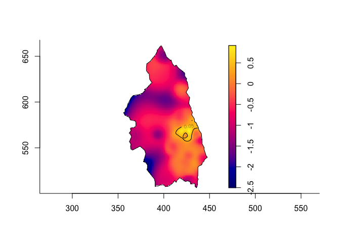

<!-- README.md is generated from README.Rmd. Please edit that file -->
sparr: Spatial and Spatiotemporal Relative Risk
===============================================

The `sparr` package for R provides functions to estimate fixed and adaptive kernel-smoothed spatial relative risk surfaces via the density-ratio method and perform subsequent inference. Fixed-bandwidth spatiotemporal density and relative risk estimation is also supported.

Installation
------------

This package is available on CRAN, and we recommend installing it from there using the standard

``` r
install.packages('sparr')
```

If you wish to live on the bleeding edge, you may install from github using `devtools`:

``` r
# install.packages("devtools")
devtools::install_github('tilmandavies/sparr')
```

Example
-------

This is a basic example of relative risk estimation for primary biliary cirrhosis cases from north east England.

``` r
# Load library
library(sparr)
#> Loading required package: spatstat
#> Loading required package: spatstat.data
#> Loading required package: nlme
#> Loading required package: rpart
#> 
#> spatstat 1.55-0       (nickname: 'Stunned Mullet') 
#> For an introduction to spatstat, type 'beginner'
#> 
#> 
#> Welcome to
#>    _____ ___  ____  ____  ____         
#>   / ___// _ \/ _  \/ __ \/ __ \        
#>   \__ \/ ___/ __  /  ___/  ___/        
#>  ___/ / /  / / / / /\ \/ /\ \          
#> /____/_/  /_/ /_/_/  \__/  \_\   v2.2-12
#> 
#> - type news(package="sparr") for an overview
#> - type help("sparr") for documentation
#> - type citation("sparr") for how to cite

# Load data on cases of primary biliary cirrhosis from north east England
data(pbc)

# Split into cases and controls
pbc_case <- split(pbc)$case
pbc_cont <- split(pbc)$control

# Estimate global bandwidth for smoothing
h0 <- OS(pbc, nstar="geometric")

# Compute a symmetric (pooled) adaptive relative risk estimate
# with tolerance contours
pbc_rr <- risk(pbc_case, pbc_cont, h0=h0, adapt=TRUE, tolerate=TRUE,
               hp=OS(pbc)/2, pilot.symmetry="pooled", davies.baddeley=0.05)
#> Estimating case density...
#> Done.
#> Estimating control density...Done.
#> Calculating tolerance contours...Done.

# And produce a plot
plot(pbc_rr)
```


